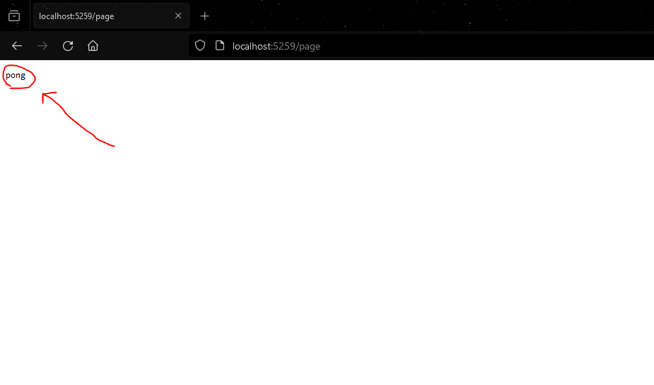

# ASP.NET: A Step-by-step guide on creating your first API.
### By Vittorio Pivarci

---

## Introduction
This documentation explains how to construct a RestAPI using C# and ASP.NET, and an overview of the implementations of this solution. 

## Step 1: Create the project

    1. Open the console;
    2. In the desired directory, type "dotnet new sln -o {Name}" (replacing {Name}) with your name of choice;
    3. Enter the folder and type "dotnet new classlib -o {Name}.{Name}" to create a class library folder;
    4. In the same folder, type "dotnet new webapi -o {Name}" to create a webapi template project.

The above procedures will generate a solution for your project, a class library for your custom implementations and behavior, and a webapi project which will handle the communication between your classes and an http address.

## Step 2: Adding controllers

Controllers serve as a way to communicate between the website and the machine using http actions, such as ``` GET ``` and ```PUT```. Defining a controller defines a new page for your website. In our case, this website is only a handle for getting/setting information and is not intended to have a designed user interface.
To add controllers, follow these steps:

    1. In the generated webapi project folder, create a "Controllers" folder;
    2. Create a new script;
    3. Inside the script, define the controller, including the asp.net and http usings and directives.

The resulting script should be as follows:

```csharp

//Usings for communicating with the API
using System;
using System.Net.Http;
using System.Threading.Tasks;
using System.Collections.Generic;
using System.Net;
using Microsoft.AspNetCore.Mvc;

//Namespace is optional
namespace Tasks.Controllers{

    //The class name should include "Controller" after it's actual name.
    [ApiController]
    [Route("[controller]")]
    public class PageController : ControllerBase{

        /*This method is called upon entering the following address:
        http://localhost<port>/page
        */
        [HttpGet]
        public string Ping(){
            return "pong";
        }
       
    }
    
}
```
The code above defines a class named "PageController" as an API controller (to communicate between machine and server). The class then defines a method called "Ping", which returns "pong". This method is marked as a ```GET``` operation using the ```[HttpGet]``` attribute, this means that the method will be called once the client enters the specified address.

## Step 3: The address

Running the project will result in an address, this address is the local address generated once the computer starts hosting the server, it usually looks like this:

```
    http://localhost:<port>/
```

The ```<port>``` is a placeholder. The port will be generated by the computer upon running the dotnet solution, usually represented by a 4 digit number, such as ```5000``` or ```5001```.

## Step 4: Configuring the controllers

After adding the controllers inside their respective folder, you must specify their usage in the root code of your webapi solution, usually labeled as ```Program.cs```.
Open the file, and replace the generated template with the following code:

```csharp
var builder = WebApplication.CreateBuilder(args);
// Add services to the container.
builder.Services.AddControllers();
var app = builder.Build();

// Configure the HTTP request pipeline.
if (!app.Environment.IsDevelopment())
{
    app.UseExceptionHandler("/Error");
    app.UseHsts();
}

app.UseHttpsRedirection();

app.UseRouting();

app.UseAuthorization();

app.MapControllers();  //Map controllers in the folder

app.Run();
```

This code, upon compilation, will initialize the WebAPI and specify all the controllers in the dedicated folder. This step is **crucial** to ensure the availability of the controllers during runtime.

## Step 5: Running the solution

In the console/command prompt, enter the folder where the webapi solution ```(.sln)``` is located, then type ```dotnet run``` to initialize the server for the API. The output should be the following (address port may be different):

```batch
info: Microsoft.Hosting.Lifetime[14]
      Now listening on: http://localhost:5000
info: Microsoft.Hosting.Lifetime[0]
      Application started. Press Ctrl+C to shut down.
info: Microsoft.Hosting.Lifetime[0]
      Hosting environment: Development
info: Microsoft.Hosting.Lifetime[0]
      Content root path: C:\{YourPath}\{FolderName}
```
``` Content root path: C:\{YourPath}\{FolderName} ``` specifies the target of your WebAPI solution.

**TIP:** You can use `dotnet run --urls http://<Device_IP>:<Port>` to allow other devices on the same network to communicate with the API, as this will turn the address into your machine's network IP. You can check your device IP by running `ipconfig` in the terminal.

## Step 6: Navigating the website

While it is not an actual "website", given the fact that the subject of matter is an API, it is still possible to navigate the http addresses, because that will be used by other programs whom attempt to communicate with the API. It doesn't have an interface, but the return contents of methods will be displayed on the screen of your browser.
Paste the generated ```localhost``` link into your browser of choice. Accessing different controllers requires you to access the page labeled by their name minus "Controller", as follows:

```
    PageController = http://localhost:5000/Page
```
Entering the address above will redirect you to the page desbribed by the PageController class, which should display "pong" as specified by the Ping method's return value:



## Step 7: Communicating with the API from another program

Now comes the most intriguing functionality, the inter-process communication. While your website is being hosted, other programs can generate http requests to it. The fun part is that any language can generate these requests.
Below are a few examples of http requests for different programming languages:

### C#:
```csharp
using System.Net.Http;
using System.Threading.Tasks;

public async Task GetTasksAsync()
{
    HttpClient client = new HttpClient();
    HttpResponseMessage response = await client.GetAsync("http://localhost:5000/page");
    response.EnsureSuccessStatusCode();
    string responseBody = await response.Content.ReadAsStringAsync();
}
```

### JavaScript:
```js

fetch(`http://localhost:5000/page`)
    .then(response => response.text())
    .then(data => console.log(data))
    .catch((error) => {
      console.error('Error:', error);
    });

```

## Step 8: Adding a SQL Database with Entity framework

Let's go one step beyond, what if we added a way for users to add, modify and remove data from a database? Like sending messages in a forum for example. In order to add SQLite to your WebApi project, please follow these steps:

#### 1 - In the terminal inside the WebApi folder, run:
`dotnet add package Microsoft.EntityFrameworkCore.Sqlite`
`dotnet add package Microsoft.EntityFrameworkCore.Design`

Also make sure to include the installed libraries:
```csharp
using Microsoft.EntityFrameworkCore.Sqlite;
using Microsoft.EntityFrameworkCore.Design;
```

These libraries will handle the SQL operations and their construction, eliminating the need of creating a separate SQL file. This allows the creation of tables and queries inside the C# code itself. It's worth noting that some scenarios you might want to use an external database file instead. 

#### 2 - Create a model class:
Using `TaskController.cs`, a file available in this repository, as an example, create the model class as follows:

```csharp
    public class TaskItem
    {
        public int Id {get; set;}
        public string Name {get; set;}
        public bool IsComplete {get; set;}
    }
```

This class will be used as reference when creating the SQL table for the API.

#### 3 - Create a context class:

This class will be used to create a context for the database, which handles the querying and managing of your entity instances inside the database. The definition is done as follows:

```csharp
  public class TaskContext : DbContext
    {
        //Pass context options to base constructor
        public TaskContext(DbContextOptions<TaskContext> opts) : base(opts) {}
        
        public DbSet<TaskItem> TaskItems {get; set;}
    }
```

A custom context is created for the Task model by inheriting from the `DbContext` class, which defines a list of `TaskItem`s, which is a collection of items that can be queried during the execution of the database. 

#### 4 - Create the controller class:

Now, create the controller class in the same manner as discussed previously:

```csharp
    [ApiController]
    [Route("[controller]")]
    public class TaskController : ControllerBase
    {
        private readonly TaskContext _context; //Reference the database context the controller is reffering to

        public TaskController(TaskContext context){
            _context = context;
        }

        //Get all tasks in the database and return on get request
        [HttpGet]
        public async Task<ActionResult<IEnumerable<TaskItem>>> GetTasks(){
            return await _context.TaskItems.ToListAsync();
        }

        [HttpPost]
        public async Task<ActionResult<TaskItem>> PostTask(TaskItem item){
            _context.TaskItems.Add(item);
            await _context.SaveChangesAsync();

            return CreatedAtAction(nameof(GetTasks), new { id = item.Id }, item);
        }
    }
```

This class references a `TaskContext` upon construction. 
An `[HttpGet]` method is defined that returns all items queried in the database.
An `[HttpPost]` method is defined that queries an item to the database's context. 

It's worth noting that the methods are marked as `async`so that their execution doesn't interrupt the main thread and cause delays or freezes.

#### 5 - Add the database service to the program during runtime:

Finally, to achieve functionality, we must add the newly created database to the program services, so that it executes and works properly, this is done by modifying the `program.cs` file (the one that we mapped the controllers earlier on this guide). The following snippet must be added:

```csharp
builder.Services.AddDbContext<TaskContext>(options =>
    options.UseSqlite(builder.Configuration.GetConnectionString("TaskContext")));

//Add the above before this:
builder.Services.AddControllers();
```

This will add the database service controller to the builder, and ensure it's correct initialization upon runtime.
`<TaskContext>` should be replacement for your DbContext class, whatever you named it as. Don't forget to add the necessary compiler references:
```csharp
    using Tasks.Controllers;
    using Microsoft.AspNetCore.Mvc;
    using Microsoft.EntityFrameworkCore;
    using Microsoft.EntityFrameworkCore.Sqlite;
    using Microsoft.EntityFrameworkCore.Design;
```

#### 6 - Executing and testing:

Before running the project, we must run the following commands in the terminal:

```batch
    dotnet tool install --global dotnet-ef
    dotnet ef migrations add InitialCreate
    dotnet ef database update
```

These commands will install the `EF Core tools` CLI extension (which enables the dotnet ef commands) and initialize the database alongside its collections. Not doing that will result in a `500 Internal server error` when trying to use any of the http requests, because the database tables have to be initialized first.
Now we can execute the project using `dotnet run`.

In this context, a "Migration" is a set of commands to keep the database updates aligned with the aplication's data model, while preserving the existing data. When using `dotnet ef migrations add InitialCreate`, you can replace "InitialCreate" with your desired migration name. This means that if you make any changes to your database code, you can add another migration and update your database to it in the terminal.

If you came across the error message " `SQLite Error 1: 'no such table: __EFMigrationsHistory'.` " in the terminal, after executing `dotnet ef database update`, it means that SQLite cannot find your database. Follow these steps:

1. Check your Program.cs file. Does it correctly initialize SQLite with a connection string?

```csharp
builder.Services.AddDbContext<TaskContext>(options =>
    options.UseSqlite(builder.Configuration.GetConnectionString("TaskContext")));
    //In this case, the connection string is "TaskContext". Replace that with your
    //Context class name.
```

2. Define the connectionstrings inside the `appsettings.json` file, found inside your WebApi solution folder:

```json
"ConnectionStrings": {
    "TaskContext": "Data Source=tasks.db"
  }
```
    
Doing this should allow Entity Framework to automatically create the database (`.db`) file for you.

#### 7 - Updating your database table

You can update your database variables if necessary, this can be done by creating a new migration and then updating the database in the terminal, doing so will match the database's information to the newest migration.

## Step 9: Communicating with the database

Congratulations! You've gone through the difficult part. Now all we have to do is communicate with the API, to access the controllers' http request methods. This can be done in several ways, such as programmatically with any programming language, or inside the terminal.
Here's a snippet of the javascript file located in `Requesters/request.js` as an example:

```javascript
const url = "http://localhost:5259";

function put(_name, _isComplete){
    let data = { name: _name, isComplete: _isComplete};
    let targetUrl = `${url}/task/post`;

    fetch(targetUrl, {
      method: 'POST', 
      headers: {
        'Content-Type': 'application/json',
      },
      body: JSON.stringify(data),
    })
    .then(response => {
        if(!response.ok){
            throw new Error(`HTTP error! status: ${response.status} at ${targetUrl}`);
        }
        return response.json();
    })
    .then(data => {
      console.log('Success:', data);
    })
    .catch((error) => {
      console.error('Error:', error);
    }); 
}
```

In this script, it's declared a function that takes a string (`_name`) and a boolean (`_isComplete`) as parameters. It's then created a dictionary variable to group both of these parameters, called `data`. A variable called `targetUrl` is also created, by concatenating the static URL string with the path for the database input.
Using the `fetch()` function, included in javascript by default, it's generated a POST request to the database, transforming the input data as a JSON string.
After fetching, the `.then` function is declared which is ran after the `fetch()` promise(async function) has been called. An anonymous function is used as a parameter, taking the http response as parameter, which then is checked for success or failure. Results are printed in the terminal.
Another `.then()` prints out the data as a success, otherwise a `.catch()` prints a runtime exception.

The two key components noticeable in this snippet are `method: 'POST'` and `data`, these are intrinsic to the program functionality, as you must first choose what SQL operation to execute, and what data to parse.

#### Alternatively: communicating using the terminal

You can also use CLI tools to communicate with an API. For this example we will use the `batch` shell and the `curl`tool.

**GET Request:**

```batch
    curl http://localhost:5259/Task/get
```

With the command above, we access the url and get whatever it returns, in this case the database collection.

**POST Request**

Windows Command Prompt:
```batch
    curl -X POST -H "Content-Type: application/json" -d "{\"name\":\"New Task\", \"isComplete\":false}" http://localhost:5259/Task/post
```

PowerShell:
```batch
    curl -X POST -H "Content-Type: application/json" -d '{`"name`":`"New Task`", `"isComplete`":false}' http://localhost:5259/Task/post
```

With the command above, we define the `SQL operation`, the header, and the `data` variable. Then we pass the URL where the GET operation method routs to.


## Step 10: Creating outputs for your controller methods

Controller methods can have different types of outputs (return types), this is especially useful for debugging, when you want to know how the information is behaving, when it's being added to your database and if there are any errors. Here are some examples:

**Basic string:**

```csharp
    [HttpGet]
    public string HelloWorld(){
        return "Hello world!";
    }
```

When the above method is called by request, it will return the string `"Hello world!"` synchronously. 

**ActionResult generic task:**

A task is basically a procedure, this procedure can be done asynchronously, this means that it'll use another thread and avoid potential freezes or delays. This special kind of method is marked as `async`. This method returns a task identified as `ActionResult`, which is a class that defines what a controller returns as a reponse, in the context of internet requests. It's more appropriate to return for general data types as you can't mark string methods as `async`, but you can still return a string from a `Task<ActionResult>`:

```csharp
    [HttpGet]
    public async Task<ActionResult> Sum(){
        int sum = 1 + 1;
        return Content($"1 + 1 = {sum}.");
    }
```

In this case, the function `Content()` is returned from the method, which is a valid ActionResult. There are many other `ActionResult` methods that can be applied for different purposes, such as `CreatedAtAction()` and `Ok()`.

**Generic ActionResult generic task:**

`ActionResult` can also be used as a generic class, and the type you define it as can be used as a return, instead of using compatible methods like `Content()`:

```csharp
    [HttpGet("get")]
    public async Task<ActionResult<IEnumerable<TaskItem>>> GetTasks(){
        return await _context.TaskItems.ToListAsync();
    }
```

The return type of the method is `Task<ActionResult<IEnumerable<TaskItem>>>`, this means that you can simply return an IEnumerable instance and it will still count as a valid `ActionResult`.

## Step 11: Allowing CORS (Cross-Resource origin sharing)

An issue you might have crossed by is trying to access the API from another url, hosted as a different website. There's a security measure called "CORS" that blocks data from being shared across different domains. This, however, can be toggled:

1. Install the dotnet core CORS package:

```batch
    dotnet add package Microsoft.AspNetCore.Cors
``` 
2. Add CORS to your API services (in Program.cs):

```csharp
    services.AddCors(options =>
    {
        options.AddPolicy("AllowAllOrigins",
            builder =>
            {
                builder.AllowAnyOrigin()
                       .AllowAnyHeader()
                       .AllowAnyMethod();
            });
    });
```
With this implementation you can filter what external source can tinker with your API (calling for GET and POST requests). You can change `"AllowAllOrigins"` to whatever CORS policy name you prefer.

3. Activate the use of cors. Call this before `app.UseRouting()` in Program.cs:

```csharp
    app.UseCors("AllowAllOrigins");
```